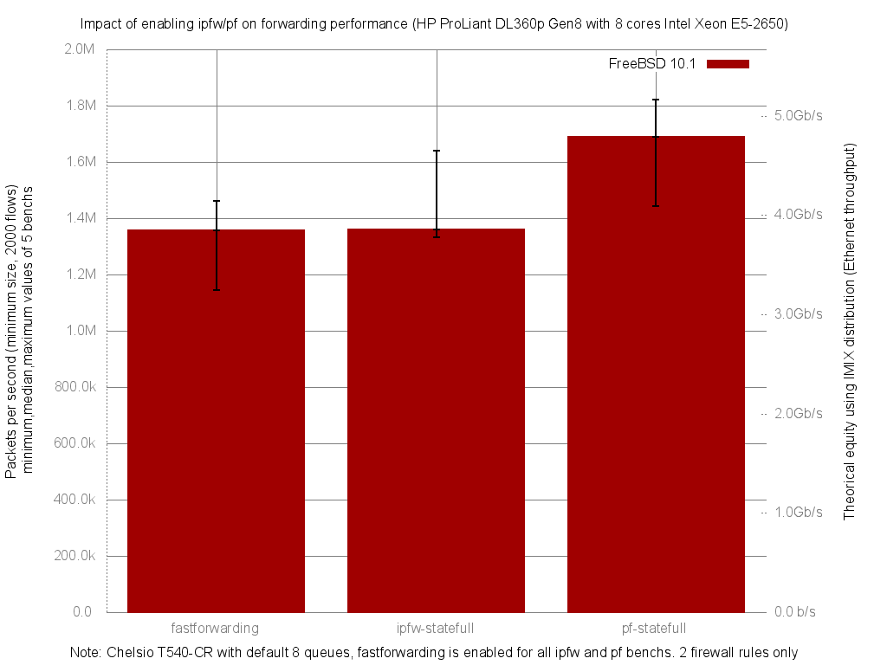

Impact of enabling ipfw or pf on forwarding performance
  - HP ProLiant DL360p Gen8 with height cores (Intel Xeon E5-2650 @ 2.60GHz)
  - Quad port Chelsio 10-Gigabit T540-CR and OPT SFP (SFP-10G-LR).
  - FreeBSD 10.1
  - 2000 flows of smallest UDP packets
  - 2 firewall rules, 2 static routes
  - ntxq10g and nrxq10g = number of core (default) = 8
  - Traffic load at 10Mpps
  - [lab details] (http://bsdrp.net/documentation/examples/forwarding_performance_lab_of_a_hp_proliant_dl360p_gen8_with_10-gigabit_with_10-gigabit_chelsio_t540-cr)




```
x pps.fastforwarding
+ pps.pf-statefull
* pps.ipfw-statefull
+--------------------------------------------------------------------------+
|x                   * **        + x                * *    +        +     +|
|        |_____________AM____________|                                     |
|                                          |______________AM______________||
|                 |_____M__________A________________|                      |
+--------------------------------------------------------------------------+
    N           Min           Max        Median           Avg        Stddev
x   5       1143948       1460687       1356714     1349469.2     128899.24
+   5       1441781       1820548       1688778       1679522     144625.81
Difference at 95.0% confidence
	330053 +/- 199790
	24.458% +/- 14.8051%
	(Student's t, pooled s = 136988)
*   5       1332121       1639632       1358896     1459932.6     154664.67
No difference proven at 95.0% confidence
```
