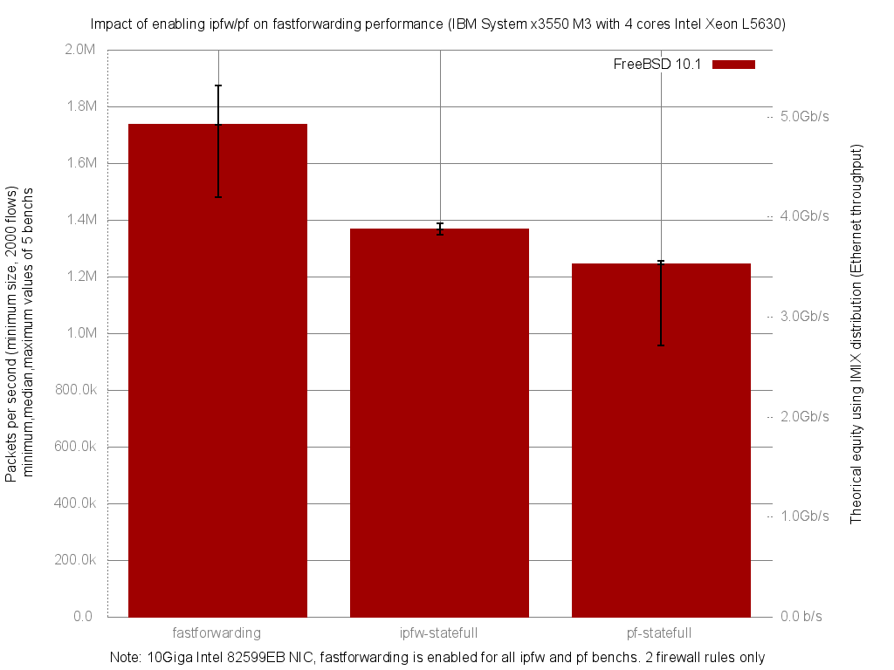

Impact of enabling ipfw or pf on forwarding performance
  - IBM System x3550 M3 with quad cores (Intel Xeon L5630 2.13GHz, hyper-threading disabled)
  - Dual port Intel 82599EB 10-Gigabit and OPT SFP (SFP-10G-LR)
  - FreeBSD 10.1
  - 2000 flows of smallest UDP packets
  - 2 firewall rules, 2 static routes
  - Traffic load at 14.48Mpps (10Gigabit line-rate)



 
```
x pps.fastforwarding
+ pps.ipfw-statefull
* pps.pf-statefull
+--------------------------------------------------------------------------+
|                       *         +                                        |
|                       *         +        x                               |
|*                      **      + ++       x                   x     x    x|
|                                           |_____________A____M_________| |
|                                |A|                                       |
|        |__________A___M_____|                                            |
+--------------------------------------------------------------------------+
    N           Min           Max        Median           Avg        Stddev
x   5       1480505       1873360       1736858     1678400.2      184104.6
+   5       1347599       1387989       1367033       1368068     14594.311
Difference at 95.0% confidence
	-310332 +/- 190458
	-18.4898% +/- 11.3476%
	(Student's t, pooled s = 130590)
*   5        956175       1256100       1244610     1188869.2     130228.25
Difference at 95.0% confidence
	-489531 +/- 232561
	-29.1665% +/- 13.8561%
	(Student's t, pooled s = 159458)
```
